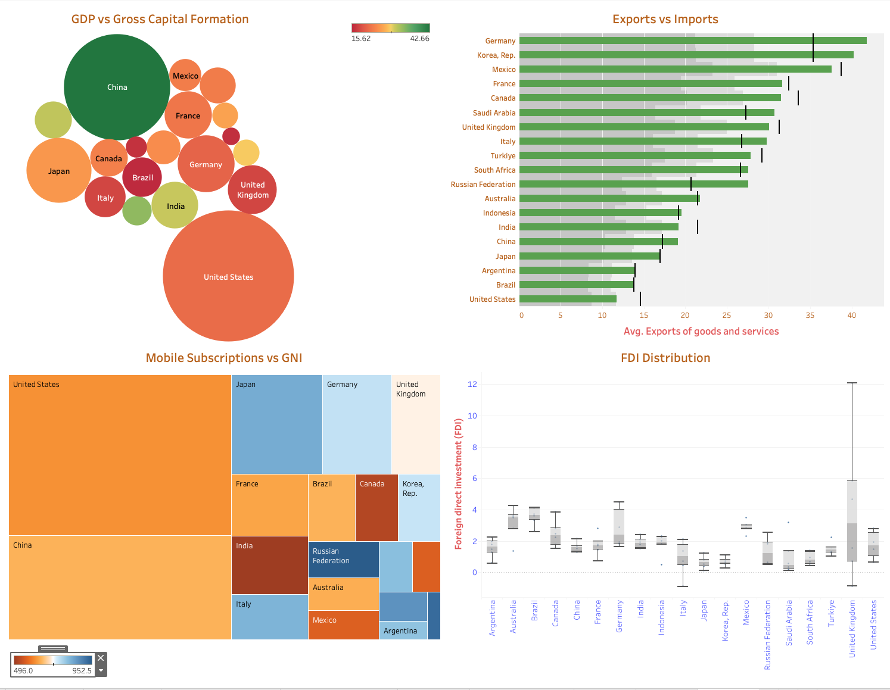
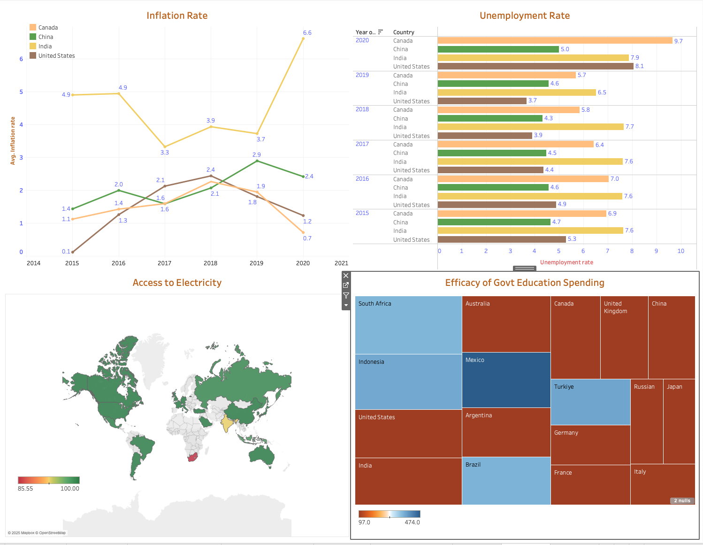

# 🌍 World Bank G20 Countries Data Analysis (Python API + Tableau)

_Analyzing G20 countries’ economic growth, trade balance, digital penetration, and public services using Python, World Bank API, and Tableau dashboards._

---

## Table of Contents
- [Business Problem](#business-problem)
- [Data Gathering](#data-gathering)
- [Tools and Techniques](#tools-and-techniques)
- [Project Structure](#project-structure)
- [Data Cleaning & Preparation](#data-cleaning--preparation)
- [Exploratory Data Analysis (EDA)](#exploratory-data-analysis-eda)
- [Research Questions & Key Findings](#research-questions--key-findings)
- [Dashboards](#dashboards)
- [How to Run](#how-to-run)
- [Author](#author)

---

## Business Problem
Effective, comparable insights across **G20 economies** are essential for policy and investment decisions.  
This project asks whether **public services are keeping pace with growth** while also examining **trade, digital inclusion, and investment**.  
**Objectives:**
- Identify **growth leaders/laggards** across GDP and per‑capita metrics.
- Examine **trade balances** to understand external dependencies.
- Test whether **digital penetration aligns with income levels**.
- Assess if **public services** (electricity, literacy/education) keep up with growth.
- Summarize **FDI dynamics** and macro stability (inflation, unemployment).

---

## Data Gathering

- World Bank API for data collection
- Source: **World Bank Open Data API** (`api.worldbank.org`)

## Tools and Techniques

- Python (Pandas, Matplotlib, Seaborn)
- Tableau (Dashboards & Visuals)
- Jupyter Notebook for analysis
- World Bank API for data collection

## Project Structure

```
World-Bank-G20-Analysis
├── README.md 
├──.gitignore
├── requirements.txt
├── World_Bank_G20_Analysis_Report.pdf
│
├── data            # dataset exported for Tableau dashboards
│   └── g20_worldbankdata_Dashboard.xlsx
|
├── images          # dashboard images
│   └── Dashboard_1
│   └── Dashboard_2
|
├── notebooks      # Jupyter notebook
│   └── G20_Countries_Analysis.ipynb
│
├── dashboards      # Tableau Dashboard File
│   ├── World_Bank_Project.twb
│
├── scripts         # Python scripts for ingestion and processing
│   ├── wb_fetch_data.py 
│   └── wb_clean_prep.py
|   └── wb_eda_plots.py
|   └── wb_top3.py
```

---

## Data Cleaning & Preparation
- **Filter** to G20 economies only to ensure focused comparability.
- **Align years** (default 2015–2020) and **normalize country codes**.
- **Core Indicators** used:
   - GDP total & per capita (`NY.GDP.MKTP.CD`, `NY.GDP.PCAP.CD`)
   - GNI per capita (`NY.GNP.PCAP.CD`)
   - Population (`SP.POP.TOTL`)
   - Life expectancy (`SP.DYN.LE00.IN`)
   - CO₂ per capita (`EN.ATM.CO2E.PC`)
   - Exports / Imports, % of GDP (`NE.EXP.GNFS.ZS`, `NE.IMP.GNFS.ZS`)
   - Mobile subscriptions per 100 people (`IT.CEL.SETS.P2`)
   - Government education expenditure, % of gov. spend (`SE.XPD.TOTL.GB.ZS`)
   - Adult literacy rate (`SE.ADT.LITR.ZS`)
   - Access to electricity (% of population) (`EG.ELC.ACCS.ZS`)
   - FDI net inflows, % of GDP (`BX.KLT.DINV.WD.GD.ZS`)

---

## Exploratory Data Analysis (EDA)
**What I examined:**
- **GDP vs Gross Capital Formation** — investment intensity vs economic size.  
- **Exports vs Imports** — export surplus/deficit patterns and exposure.  
- **Mobile Subscriptions vs GNI** — digital vs income alignment.  
- **FDI Distribution** — cross-country dispersion and volatility.  
- **Inflation & Unemployment** — macro stability signals.  
- **Access to Electricity** — infrastructure reach and equity.  
- **Education Spend vs Literacy** — efficiency of public services.  
- **Regional Comparisons** — contrasting emerging vs advanced G20 members.  
- **Temporal Trends** — changes in inflation, unemployment, and digital penetration over the last decade.  

**Takeaways (high level):**
- 📈 Higher-income members show **near-saturation digital access**; emerging economies are **catching up fast**.  
- ⚖️ **Trade imbalances** (e.g., persistent deficits or surpluses) indicate structural risks/opportunities.  
- 💰 **FDI** is steadier in advanced economies; **volatility** is more common in emerging markets.  
- 🏭 **Inflation volatility** is concentrated in developing G20 members; advanced economies maintain relative stability.  
- 🔌 **Access to electricity** is nearly universal, with notable gaps in **India and South Africa**.  
- 🎓 **Education spending efficiency** varies — some countries spend heavily but achieve modest literacy gains, showing **policy quality matters as much as spending**.  
- 🚨 **Public services often lag income growth** — efficiency and governance, not just GDP, drive outcomes.  

---

## Research Questions & Key Findings
1. **Do higher digital penetration rates align with higher income?**  
   ✅ Yes — scatter of GNI per capita vs mobile subscriptions/100 shows a positive alignment, with emerging members closing the gap.

2. **Are public services keeping pace with growth?**  
   ⚡ Access to electricity is near-universal for most, but **education outcomes** show efficiency gaps despite high government spending.

3. **How do trade balances affect sustainability?**  
   🌍 Export-reliant economies (e.g., Germany, Korea) contrast with deficit economies (e.g., US); **trade exposure varies significantly**.

4. **Where is FDI concentrating?**  
   💰 Advanced economies attract **consistent inflows**; volatility in some emerging economies ties to policy uncertainty & macro stability.

5. **How stable are inflation and unemployment across G20?**  
   📉 Advanced economies maintain relative stability, while emerging economies (e.g., India, South Africa, Brazil) face **greater macro volatility**.

6. **Are infrastructure and equity improving alongside GDP?**  
   🔌 Electricity access lags in **India and South Africa**, highlighting that growth alone does not ensure inclusive infrastructure gains.

7. **Does education spending translate into outcomes?**  
   🎓 Some G20 members spend heavily on education yet show **modest literacy improvements**, underscoring that **efficiency of policy execution** matters more than budget size.

---

## Dashboards
### Growth, Trade, Digital, FDI
👉 [**Dashboard Link**](https://public.tableau.com/app/profile/saketh.danthuri/viz/World_Bank_Project_Dashboard2/Dashboard2) 



### Inflation, Employment, Access, Education
👉 [**Dashboard Link**](https://public.tableau.com/app/profile/saketh.danthuri/viz/World_Bank_Project_Dashboard1/Dashboard1) 
 


---

## How to Run
```bash
# 1) Install dependencies
pip install -r requirements.txt

# 2) Fetch World Bank indicators (G20, 2015–2024)
python scripts/wb_fetch_data.py --start 2015-01-01 --end 2020-12-31

# 3) Clean & prepare
python scripts/wb_clean_prep.py

# 4) Recreate EDA visuals (histograms, boxplots, correlation heatmap)
python scripts/wb_eda_plots.py

# 5) Compute Top-3 countries per year for each indicator
python scripts/wb_top3.py

# 6) Open and run notebook
   - notebook/G20_Countries_Analysis.ipynb

# 7) Open Tableau Dashboard
   - dashboard/World_Bank_Project.twb
```

---

## Final Recommendations

- **Balance trade better**  
  Some G20 countries run big trade deficits while others rely heavily on surpluses. Finding a middle ground can reduce risks from global market swings.  

- **Make foreign investments more stable**  
  Wealthier countries already get steady investment, but emerging economies see more ups and downs. Clear policies and investor-friendly rules can help bring in more consistent funding.  

- **Close the digital gap**  
  Richer countries have nearly full digital access, while developing members are catching up fast. Expanding affordable internet and mobile services will speed up inclusive growth.  

- **Improve education results**  
  Spending on education is going up, but the outcomes don’t always match. Focus should be on improving quality, making schools accessible to all, and linking skills to jobs of the future.  

- **Keep economies stable**  
  High inflation and joblessness remain issues in some countries. Stronger coordination between governments and central banks can help keep growth steady.  

- **Invest in green energy**  
  Almost all G20 members have electricity access, but renewable energy is still behind. Building more green infrastructure will support long-term growth and sustainability.  


## Authors

**Saketh Danthuri**  
Data Analyst  
📧 Email: saketh1000@gmail.com    
🔗 [LinkedIn](https://www.linkedin.com/in/saketh-danthuri/)  

